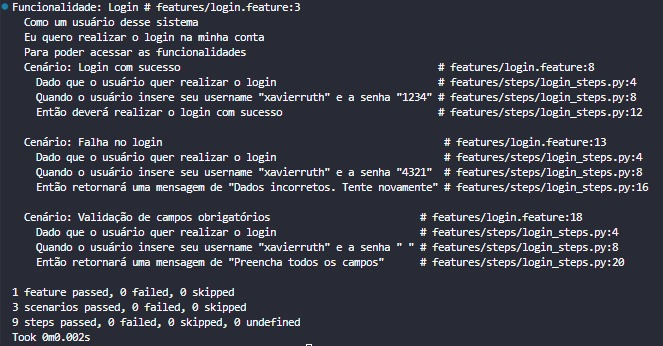

# Atividade Prática - BDD

Atvidade prática para aplicar os conceitos de BDD usando a biblioteca behave. 

- Exercício 1: Criar cenário de login com sucesso; 
- Exercício 2: Criar cenário de falha no login 
- Exercício 3: Criar cenário de validação de campos obrigatórios 

## Estrutura 

``` bash 
bdd-qa/
├── features/
│ ├── login.feature 
│ └── steps/
│ └── login_steps.py 
├── src/
│ └── login.py 
├── image/
│ └── testebehave.jpg 
├── requirements.txt 
└── README.md 

```
## Como Executar os Testes

1. Criação do ambiente virtual

```bash
python -m venv .venv
source .venv/bin/activate     # Linux/macOS
.venv\Scripts\activate        # Windows

```

2. Instalando as dependências 

- Instalar a extensão do Gherkin na sua IDE

``` bash 
pip install -r requirements.txt
```

3. Execute os testes 

``` bash 
behave
```

## Tecnologias 

- Python
- Behave 
- Gherkin

## Resultado

Todos os testes passaram sem nenhuma falha 

<p align="center">
  
</p>


## Autora 

#### Ruth Xavier 

- [Linkedin](https://www.linkedin.com/in/ruthxavier/)
- [Github](https://github.com/xavierruth)
- [Behance](https://www.behance.net/xavierruth)


